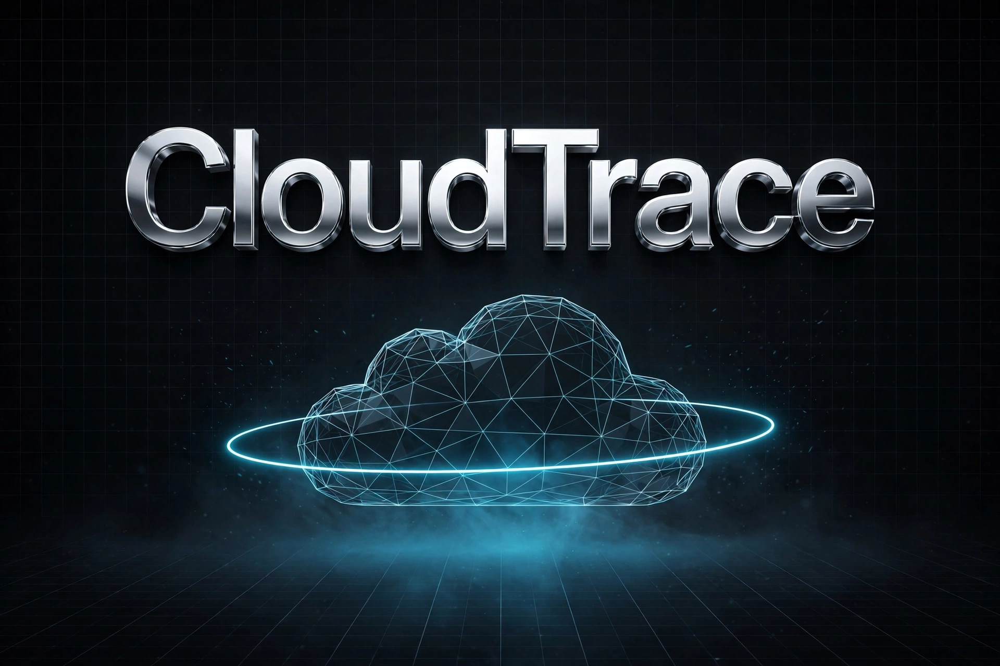

# CloudTrace - AWS Threat Detection & Incident Response Lab

**Attack the Cloud. Trace the Signal. Prove the Incident.**

*Every alert is traced through four independent sources CloudTrail, Linux logs, Windows Events, and packet captures before it's called an incident.*

[]()
[]()
[]()
[]()
[]()
[]()
[]()
[]()
[]()
[]()

## How It Works - From Attack to Report



**Flow:** Attacker (Kali) -> AWS VPC (Linux + Windows + Network) -> Telemetry (CloudTrail, auth.log, Event IDs, PCAP) -> Wazuh SIEM -> SOC L1/L2 Playbooks -> Python Correlation Engine -> Incident Report + MITRE ATT&CK

## What I Built & Proved

- Built a fully segmented AWS lab from scratch with Terraform (VPC, EC2, IAM, Security Groups) - no ClickOps, with CloudTrail and CloudWatch enabled for full visibility
- Wrote and battle-tested 5 custom detection rules (Wazuh + Sigma) against REAL attack traffic: Nmap recon, SSH brute force, Windows auth anomalies, and suspicious process execution
- Never trusted a single log: every alert is corroborated across 4 independent sources - AWS CloudTrail, Linux auth logs, Windows Event IDs, and raw PCAPs - to kill false positives
- Executed the full SOC loop for every alert: L1 triage, L2 deep investigation, and root cause analysis with a documented incident ticket
- Automated the boring part: built `cloudtrace.py` - a Python correlation engine that parses raw logs and PCAP metadata and reconstructs a clean incident timeline
- Mapped every proven technique to MITRE ATT&CK and tracked what matters: detection coverage, MTTD, and true/false positive rate

## What I Hunt & How I Prove It

| Attack I Simulate | Where It Leaves Traces | How I Catch It | MITRE ATT&CK |
|---|---|---|---|
| Network Recon (Nmap) | PCAP, Wireshark | Custom Wazuh Port Scan Rule | T1046 |
| Linux SSH Brute Force | auth.log, journalctl | Wazuh + Sigma Rule | T1110 |
| Failed -> Success Login | Linux logs + Wazuh Correlation | High-Confidence Correlation Rule | T1110.001 |
| Windows Auth Anomaly | Event ID 4625 -> 4624 | Wazuh Rule | T1110 |
| Windows Suspicious Process | Event ID 4688 (Process Creation) | Wazuh Rule + Sysmon Logic | T1059.001 |

> Status: Lab in build phase - each row moves from `Planned -> Validated -> Investigated -> Reported` with evidence in `/evidence` and `/incidents`.

## The Arsenal

**Cloud & IaC:** AWS (VPC, EC2, IAM, CloudTrail, CloudWatch) + Terraform - no ClickOps
**Endpoints:** Linux (auth.log, journalctl, ps, ss) + Windows (Event IDs 4624, 4625, 4688, 4672, 4720)
**Network:** Nmap for recon, tcpdump for capture, Wireshark for deep dive
**Detection:** Wazuh + Custom Sigma rules (my own, not just imported)
**Automation:** Python (`cloudtrace.py` correlation engine)
**Framework:** MITRE ATT&CK for every single finding

## Repository Structure

```
cloudtrace-aws-incident-detection/
├── architecture/    Architecture diagrams
├── docs/            Threat scenario, attack chain, investigation workflow, detection matrix
├── terraform/       AWS infrastructure as code
├── detections/      Wazuh rules (XML) + Sigma rules (YAML)
├── playbooks/       Incident response playbooks (IR-01 to IR-05)
├── python/          cloudtrace.py — evidence correlation & timeline engine
├── evidence/        Raw logs/telemetry (linux, windows, network, aws, wazuh)
├── incidents/       Full incident case files (ticket, timeline, IOCs, report)
├── screenshots/     Visual proof of alerts, PCAP analysis, timelines
├── metrics/         Detection performance metrics
└── mitre/           MITRE ATT&CK technique mapping
```

## Try to Break & Prove It Yourself

> ⚠️ **Warning:** CloudTrace deploys real AWS infrastructure and may incur AWS charges. Run it only in an AWS account you own and keep the environment isolated. Never test systems you do not own or have explicit authorization to test.

    git clone https://github.com/YOUR_USERNAME/cloudtrace-aws-incident-detection.git
    cd cloudtrace-aws-incident-detection/terraform
    terraform init
    terraform apply

Follow the investigation workflow:

- `docs/investigation-workflow.md`
- `docs/attack-chain.md`

When finished:

    terraform destroy

> **Important:** Verify that all billable AWS resources have been removed.
